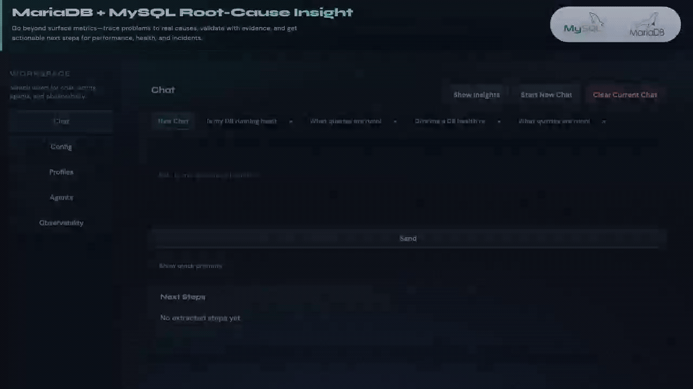

# MariaDB & MySQL Database Agents

AI-powered DBA assistance for MariaDB and MySQL. Ask questions in plain English — get evidence-backed analysis, root-cause findings, and prioritised action plans. **100% read-only. Nothing is changed without your approval.**

[](docs/media/dba-assist-demo.gif)

---

## What problems does it solve?

| Situation | Ask the agent |
|-----------|--------------|
| Something is wrong but you don't know where to start | *"Can we get a comprehensive analysis on our DB — performance, everything?"* |
| Queries are slow and you don't know why | *"Analyze slow queries from the last hour"* |
| A runaway query is blocking everyone | *"What queries are running right now?"* |
| You suspect replication is lagging | *"Check replication health"* |
| You need to investigate something specific | *"Show me the top tables by I/O in the last hour"* |

---

## What does a real response look like?

Here is an actual response to *"Can we get a comprehensive analysis on our DB — performance, everything?"*:

<details>
<summary><strong>Expand full example response</strong></summary>

> **Executive summary** — the DB does not show signs of a broad outage, connection exhaustion, or cache/I/O collapse. Three real issues found:
>
> **1. Row lock contention is the clearest performance problem**
> - Active lock wait observed: 1
> - Average row lock wait time: **4,345 ms**
> - Workload centred on `test_lock_table` with overlapping `SELECT … FOR UPDATE` and `UPDATE … WHERE value BETWEEN …`
>
> **2. A query pattern is causing high temp-table spill to disk**
> - `Created_tmp_disk_tables`: 5,682
> - Disk temp-table ratio: **24.9%**
> - A `GROUP BY / ORDER BY / GROUP_CONCAT(…)` pattern identified as the contributor
>
> **3. Slow-query log is dominated by synthetic workload**
> - Six `SELECT SLEEP(?)` patterns account for ~93% of slow-query time
> - This masks real tuning targets
>
> **Prioritised action plan**
> 1. Fix lock contention — review transactions around the `BETWEEN` range queries on `test_lock_table`
> 2. Tune the temp-table-heavy aggregation query — run `EXPLAIN`, reduce concurrency
> 3. Separate synthetic `SLEEP()` workload from production slow-log analysis
> 4. Re-check replication from a primary-routed admin connection
>
> *Full domain-by-domain breakdown (locking, slow queries, execution plans, connections, I/O, replication, SkySQL observability) available on request.*

</details>

---

## Quick start (UI)

```bash
git clone https://github.com/mariadb-JagsR/mariadb-db-agents.git
cd mariadb-db-agents

pip install -e .

cp .env.example .env
# Fill in DB_HOST, DB_USER, DB_PASSWORD, OPENAI_API_KEY

cd mariadb_db_agents
./scripts/run_ui.sh
```

Open **http://127.0.0.1:5173** — a chat interface with config editor, profile switching, agent toggles, and token dashboards.

**Need more queries to try?** See [Sample DBA Questions](docs/SAMPLE_DBA_QUESTIONS.md).

---

## Other ways to use it

**CLI (one-shot)**
```bash
python -m mariadb_db_agents.cli.main orchestrator "Is my database healthy?"
```

**CLI (interactive)**
```bash
python -m mariadb_db_agents.cli.main orchestrator --interactive
```

**IDE via MCP** (Cursor, Windsurf, Claude Code)
```bash
# Add the MCP server to your IDE — see docs/MCP_SETUP.md
# Then ask in chat: "What queries are running right now?"
```

---

## Agents

| Agent | What it analyses |
|-------|-----------------|
| **Orchestrator** | Routes your question to the right specialist(s), synthesises the results |
| **Slow Query** | Historical slow queries — patterns, EXPLAIN plans, index suggestions |
| **Running Query** | Live processlist — blocking queries, lock waits, current resource usage |
| **Incident Triage** | Broad health snapshot — connections, locks, I/O, error logs, SkySQL observability |
| **Replication Health** | Replica lag, broken chains, GTID state |
| **Database Inspector** | Ad-hoc read-only SQL with AI interpretation of results |

All agents are **read-only**. Recommendations are suggestions only — nothing is applied automatically.

---

## Setup & configuration

### Environment variables (`.env`)

| Variable | Required | Description |
|----------|----------|-------------|
| `OPENAI_API_KEY` | Yes | OpenAI API key |
| `OPENAI_MODEL` | No | Model to use (default: `gpt-4o`) |
| `DB_HOST` | Yes | MariaDB/MySQL host |
| `DB_PORT` | No | Port (default: 3306) |
| `DB_USER` | Yes | Read-only database user |
| `DB_PASSWORD` | Yes | Database password |
| `DB_DATABASE` | Yes | Default database |
| `SKYSQL_API_KEY` | No | SkySQL API key — enables error logs and CPU/disk metrics |
| `SKYSQL_SERVICE_ID` | No | SkySQL service ID |

### Recommended DB user

```sql
CREATE USER 'dba_readonly'@'%' IDENTIFIED BY 'strongpassword';
GRANT SELECT, PROCESS, REPLICATION CLIENT ON *.* TO 'dba_readonly'@'%';
```

---

## Architecture


- **Orchestrator** routes to specialised agents and synthesises multi-agent results
- **Common infrastructure** (`common/`) provides read-only DB access, guardrails, observability tracking, and SkySQL API integration
- **Each agent** follows the same structure: `agent.py` (prompt + tools), `tools.py` (@function_tool definitions), `main.py` (CLI entry), `conversation.py` (interactive mode)

See [Architecture details](docs/ARCHITECTURE_DIAGRAM.md) for more.

---

## SkySQL / MariaDB Cloud

For SkySQL services the agents additionally fetch:
- CPU % and disk utilisation via the SkySQL Observability API (not available via SQL)
- Error logs via the SkySQL Log API

Configure `SKYSQL_API_KEY` and `SKYSQL_SERVICE_ID` in `.env` to enable these.

---

## Roadmap

Planned agents: Connection Pool Analyser · Capacity Planning · Schema & Index Health · Lock & Deadlock Detective · Security Audit

See [HIGH_VALUE_AUTOMATION_OPPORTUNITIES.md](docs/HIGH_VALUE_AUTOMATION_OPPORTUNITIES.md) for the full list.

---

## License

MIT — see [LICENSE](LICENSE).
